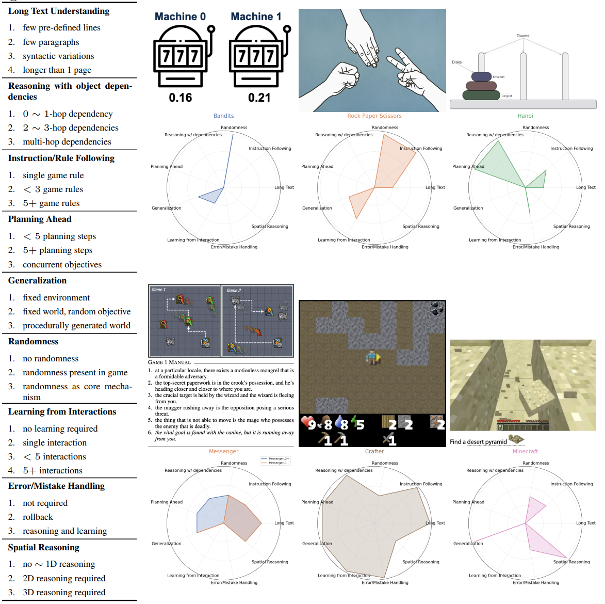

## <span style="color:red">⚠️ STOP</span>

<span style="color:red">This repo is for double-blind review ONLY.</span>

Although this repo has been tested to work as of Nov 13 2023. It will not receive any updates/bug-fixes, and must not be forked or cited.

# SmartPlay


The SmartPlay repository is a benchmark and methodology for evaluating the abilities of large language models (LLMs) as agents. It consists of six different games, including Rock-Paper-Scissors, Tower of Hanoi, and Minecraft, each featuring a unique setting that provides up to 20 evaluation settings and infinite environment variations. The games in SmartPlay challenge a subset of nine important capabilities of an intelligent LLM agent, including reasoning with object dependencies, planning ahead, spatial reasoning, learning from history, and understanding randomness. The distinction between the set of capabilities each game tests allows for the analysis of each capability separately. SmartPlay serves as a rigorous testing ground for evaluating the overall performance of LLM agents and as a roadmap for identifying gaps in current methodologies.

Currently included games are:
- Rock-Paper-Scissors
- 2-armed bandit
- Tower of Hanoi
- [Messenger-EMMA](https://github.com/ahjwang/messenger-emma)
- [Crafter](https://github.com/danijar/crafter)
- [MineDojo Creative Tasks](https://github.com/MineDojo/MineDojo/tree/main)

For more information, please refer to the [paper](https://anonymous).

## Table of Contents

- [Introduction](#introduction)
- [Games in SmartPlay](#games-in-smartplay)
- [Getting Started](#getting-started)
- [Using SmartPlay](#using-smartplay)
- [Citing SmartPlay](#citing-smartplay)
- [Contributing](#contributing)
- [Legal Notices](#legal-notices)

## Games in SmartPlay <a name="games-in-smartplay"></a>


## Getting Started <a name="getting-started"></a>

First consider setting up a conda environment by running 
```
conda env create --name SmartPlay --file environment.yml
```

SmartPlay requires MineDojo, please follow the official [documentation](https://docs.minedojo.org/sections/getting_started/install.html#direct-install) to install MineDojo first before proceeding.

Then run

```
pip install -e .
```

For completeness, we also provide conda environment scripts and requirements.txt in the root directory.

## Using SmartPlay <a name="using-smartplay"></a>

Guidelines to use the benchmark are provided in:

```
examples/experiments.py
```

To see all games available in the SmartPlay benchmark, run the following code:

```
import smartplay
print(smartplay.env_list)
```

See [MineDojo Documentation](https://github.com/MineDojo/MineDojo/blob/main/minedojo/tasks/description_files/creative_tasks.yaml) for a description of the MineDojo Creative tasks.
